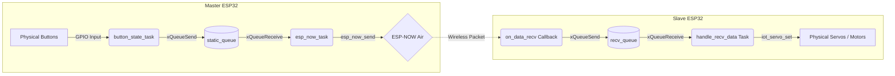

# Table Tennis Robot

This repository contains code for two ESP32s, one 'master' and 'slave'. It is an improvement upon the previous repository, found [here](https://github.com/alexchen817/TableTennisTinkers).

The framework used in this repository is the official ESP-IDF framework by Espressif Systems. Porting to this framework allowed more freedom with the addition of **FreeRTOS Tasks and Queues** in mind. The former repository relied on the Arduino framework which helped quickly prototype our robot for the 2026 FAS Competition, however, there were issues with timing and WiFi communication, which created challenging debugging sessions. 
- A thought behind the port: ESP-IDF allows for fine-tuned control of ESP32s, which allows the use of `xTaskPinnedToCore()` to separate user code and WiFi coms on separate cores as the ESP32 is a dual-core MCU. 

## Data Flow Diagram


## Features
The robot is controlled via button presses. There are 5 buttons in total, 2 for yaw (left, right), 2 for pitch (up, down) and 1 for indexing. 
- 5-state indexer
- Pitch control
- Yaw control
## Parts Used
- 2x ESP-WROOM-32 
- 1x SG90 servo motor (indexer) @ 50Hz
- 2x MG995 servo motor (pitch & yaw control) @ 50Hz
- 1x Motor Driver (SparkFun TB6612FNG) 
- Various 3D printed parts, jumper wires, buttons and other mechanical/electronic parts

## Learning Outcomes
- HAL (Hardware Abstraction Layer)
- PWM control using lEDC API 
- Servo control using `Espressif/servo` API 
- NVS (Non-Volatile Storage)
- FreeRTOS Tasks and Queues
- Reading ESP-IDF documentation for API methods
- ESP-NOW WiFi Communication Protocol (via MAC addresses)
- `idf.py` CLI
- Reading ESP32 Data Sheet
- Understanding GPIO
- Pull-Up Resistors

## Contributors 
Alex Chen (Firmware)<br></br>
Connor Chai, Daniel Jenkins (Electrical/Mechanical)

## Issues & Solutions
If the project is not building or flashing properly after changing the code, run the following commands in your current directory one by one:

MacOS/Linux: 
```bash
export IDF_PATH='/Users/<your_username>/.espressif/v5.5.2/esp-idf'

idf.py fullclean
idf.py build flash monitor
```

## Future Task(s)
- add CI/CD lint, error, and formatting checks and test cases
- swap buttons for ADC control via joysticks
